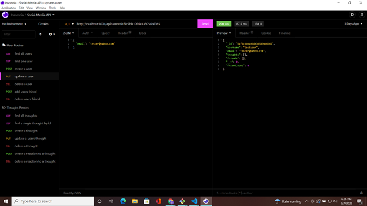

# Social-Media-API 
  ## Description 

  Using SQL is a great way for any developer to store, recall, and modify data that can be shared with and displayed on the front-end of the web browser experience, to many users around the world. While it has it's many benefit's there are some issues that come with SQL like riggidity with code, and technicality of querying the database. In comes NoSQL, which introduces another method that like SQL allows you to store data in tables in a database, but simply avoids using SQL. This project develops the beginnigns of a Social Network platform, by creating a functional backend to store and retrieve data in mongoDB, a NoSQL type database. This program along with mongoose is how I will build the database that I will then interact with to get and store user's data. It is another step for me to grow into a more realized web developer.

  ## Table of Contents
  In here you will find links to each section of this projects readme
  - [Installation](#installation)
  - [Usage](#usage)
  - [Tests](#tests)
  - [Screenshots/Video](#screenshots/video)
  - [License](#license)
  - [Questions](#questions)

  ## *Installation*

  This app run using an express server and node.js. You can download the files from the repository then npm install all dependancies onto your local system.

  ## Usage 

  The app is a functional backend server for a social networking platform. It uses mongoDB, and mongoose to query the database and retrieve, insert, and delete data to the mongoDB collections. To test the funcitons simply use insomnia, and create a few get, put, delete, and post requests to see the data structure. You may need to refer to the code for specifics on what data to input as your json body for the post and put requests. The objectID values are from mongoDB and are used as the default id values when quereing the database using specific id's. You will have to use these id strings as parameters for some of the routes in this project. 

 ## Tests

  Use insomnia to test each route, and see what happens if you input the wrong information for the json body. There are a few validators attached to the mongoDb schema models that will return error messages if criteria for data isn't met. Besides that you will find your average server error messages when usng invalid data to query the database.

  ## Screenshots/Video

  

  

  

  

  

  - Video Link: [Demo-Video](https://watch.screencastify.com/v/U99h79o19vnabHCMRomB)

  ## *License*

  Copyright 2021 &copy; Denva Emsley

      Permission is hereby granted, free of charge, to any person obtaining a 
      copy of this software and associated documentation files (the "Software"), 
      to deal in the Software without restriction, including without limitation 
      the rights to use, copy, modify, merge, publish, distribute, sublicense, 
      and/or sell copies of the Software, and to permit persons to whom the Software 
      is furnished to do so, subject to the following conditions:
          
      The above copyright notice and this permission notice shall be included in all copies or substantial portions of the Software.
          
      THE SOFTWARE IS PROVIDED "AS IS", WITHOUT WARRANTY OF ANY KIND, EXPRESS OR IMPLIED, INCLUDING BUT NOT LIMITED TO THE WARRANTIES OF MERCHANTABILITY, FITNESS FOR A PARTICULAR 
      PURPOSE AND NONINFRINGEMENT. IN NO EVENT SHALL THE AUTHORS OR COPYRIGHT HOLDERS BE LIABLE FOR ANY CLAIM, DAMAGES OR OTHER LIABILITY, WHETHER IN AN ACTION OF CONTRACT, TORT OR OTHERWISE, 
      ARISING FROM, OUT OF OR IN CONNECTION WITH THE SOFTWARE OR THE USE OR OTHER DEALINGS IN THE SOFTWARE.
      
  ## Questions 

  - My GitHub username: Demsley1
  - Link to my GitHub page and repositories: [Github Link](https://github.com/Demsley1)
  _Link to my main work email if anyone should ever choose to contact me regarding work, or with helpful suggestions on how to improve this project and 
  also fix or update any major issues with project_
  - For All inquires email me at: emsley3684@gmail.com
